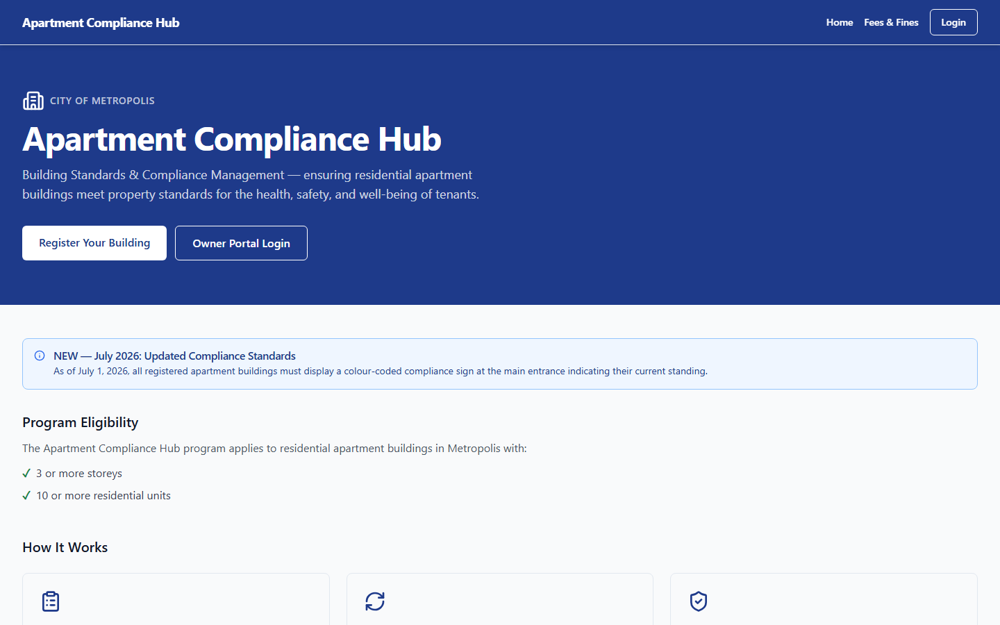
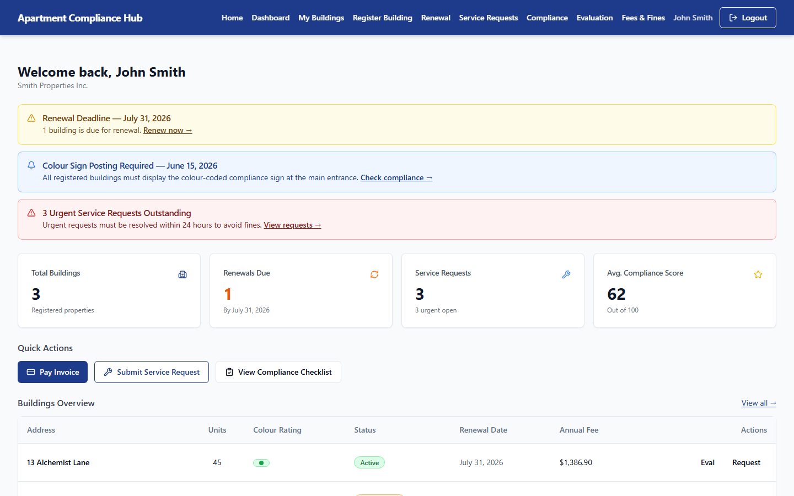
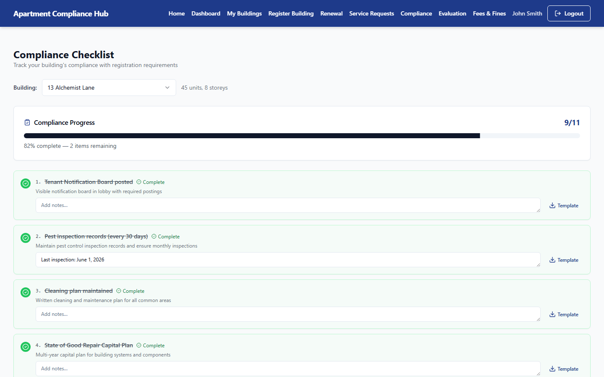

# Apartment Compliance Hub


> **Demo disclaimer:** This is a practice/portfolio project simulating an apartment building compliance & registration program for a fictional city ("Metropolis"). It is not affiliated with any real municipality.

A React + TypeScript single-page application for managing apartment building compliance registration, annual fees, fines, and colour-coded compliance status — modeled after municipal building-standards programs. Built as a portfolio piece to demonstrate a full authenticated multi-page workflow: form-heavy data entry, derived business rules (late fees, urgency-based response windows), and a WCAG 2.x AA accessibility pass across the entire app.

**Live demo:** [apartment-compliance-hub-demo.vercel.app](https://apartment-compliance-hub-demo.vercel.app/)

| Login ID | PIN    |
| -------- | ------ |
| `12345`  | `6789` |

## Contents

- [Screenshots](#screenshots)
- [Features](#features)
- [Tech Stack](#tech-stack)
- [Getting Started](#getting-started)
- [Project Structure](#project-structure)
- [Deployment](#deployment)
- [License](#license)

## Screenshots

<table>
  <tr>
    <td align="center" width="50%">
      <strong>Landing</strong><br />
      
    </td>
    <td align="center" width="50%">
      <strong>Dashboard</strong><br />
      
    </td>
  </tr>
</table>

<p align="center">
  <strong>Compliance Checklist</strong><br />
  
</p>

## Features

**Public**

- **Landing page** — program overview, eligibility criteria, colour-coded compliance status legend (Green/Yellow/Red), fee teaser, contact info
- **Fees & Fines** — full fee schedule and common fine amounts
- **404 page** — catch-all route for unmatched paths, with a link back to home (or the dashboard, if signed in)

**Owner Portal** _(authenticated)_

- **Dashboard** — welcome banner, renewal/compliance/service-request alerts, summary cards, quick actions, buildings overview table with colour rating and status badges
- **My Buildings** — searchable, filterable (by status and colour rating) table of registered buildings with an empty state
- **Register a Building** — 4-step wizard (property details, owner details, review, confirmation) with per-step validation, clickable step navigation to revisit completed steps, phone number auto-formatting, and a generated reference number
- **Renewal** — building selector scoped to buildings with "Renewal Due" status, live invoice (unit count, per-unit fee, automatic late-payment fine once past due, total owing), Zod-validated payment form (card number/expiry auto-formatting, Visa/MasterCard/Amex only), and a payment confirmation screen
- **Building Evaluation** — building selector, score breakdown by category with colour-coded progress bars, colour rating legend, evaluation history, and next scheduled evaluation date
- **Compliance Checklist** — building selector, live progress bar and completion count, toggleable checklist items with per-item notes and template download links, and a completion alert
- **Service Requests** — tabbed "New Request" / "History" view, Zod-validated submission form with automatic urgency detection per request type (24-hour vs. 7-day response window, with fine warning), and a history table with urgency/status badges

**Cross-Cutting**

- **Authentication** — session-based login with Zod-validated numeric Login ID/PIN, protected routes that redirect to `/login` and return to the originally-requested page after signing in, auth-aware UI throughout (Header, Footer, Landing, 404)
- **Error boundary** — app-wide boundary catches render errors and shows a fallback UI instead of a blank screen
- **Accessibility (WCAG 2.x AA)** — audited and fixed across every page: colour contrast, semantic heading structure, no interactive elements nested inside other interactive elements, a skip-to-content link served outside the React root for first-paint availability, focus management on route change (without hijacking the skip link on initial load), per-route document titles, and accessible form errors throughout

## Tech Stack

| Technology            | Purpose                                                                     |
| --------------------- | --------------------------------------------------------------------------- |
| React 19              | UI framework                                                                |
| TypeScript            | Type safety                                                                 |
| Vite                  | Build tool & dev server                                                     |
| Tailwind CSS 3        | Utility-first styling                                                       |
| shadcn/ui             | Component library (Radix UI primitives, "default" style / slate base color) |
| React Router 7        | Client-side routing                                                         |
| React Hook Form + Zod | Form state management & schema validation                                   |
| lucide-react          | Icons                                                                       |
| Prettier              | Code formatting                                                             |
| Vercel                | Hosting & deployment                                                        |

## Getting Started

### Prerequisites

- Node.js 18+ and npm

### Installation

```bash
npm install
npm run dev
```

Open [http://localhost:5173](http://localhost:5173) in your browser.

### Other Commands

```bash
npm run build           # Type-check and production build
npm run lint            # Run ESLint
npm run format          # Format all files with Prettier
npm run format:check    # Check formatting without writing changes
npm run preview         # Preview production build
```

## Project Structure

```
src/
├── components/
│   ├── ui/               # shadcn/ui components (Button, Card, Input, Label, Alert, Badge, Table, Select, Checkbox, Separator, Progress, Textarea, Tabs)
│   ├── layout/           # Header, Footer, ProtectedRoute
│   ├── badges/           # ColourRatingBadge, StatusBadge, ServiceRequestStatusBadge, UrgencyBadge
│   ├── ErrorBoundary.tsx # App-wide render-error fallback
│   ├── ScrollToTop.tsx   # Scroll + focus reset on route change (skips the initial mount)
│   └── DocumentTitle.tsx # Per-route document.title
├── pages/
│   ├── public/           # Landing, Fees, NotFound
│   ├── auth/             # Login
│   └── portal/           # Dashboard, My Buildings, Register, Renewal, Evaluation, Compliance, Service Requests (all protected)
├── context/
│   └── AuthContext.tsx   # Auth state + session persistence
├── hooks/
│   ├── useAuth.ts        # useAuth() hook
│   └── useBuildings.ts   # Search/filter state + stats over mock buildings
├── types/
│   └── index.ts          # Shared TypeScript interfaces
├── lib/
│   ├── utils.ts          # cn(), calculateAnnualFee(), formatCurrency(), formatDate(), formatPhoneNumber(), generateReferenceNumber(), formatCardNumber(), formatExpiryDate(), addYears(), isPastDue(), getServiceRequestUrgency(), getResponseDueDate(), generateServiceRequestId()
│   └── constants.ts      # App copy, fees, fines, demo credentials, wards, service request types
├── data/
│   ├── mockBuildings.ts  # Mock building records
│   └── mockServiceRequests.ts
├── App.tsx               # Router + providers
└── main.tsx              # Entry point
```

## Deployment

Hosted on [Vercel](https://vercel.com), connected to this repository's `main` branch for automatic production deploys (and preview deploys on pull requests).

`vercel.json` adds a catch-all rewrite (`/(.*) → /index.html`) so that direct navigation or a page refresh on any client-side route (`/fees`, `/login`, `/dashboard`, etc.) is served correctly instead of 404ing — required for any single-page app using `BrowserRouter`.

## License

Personal practice project — not for production or commercial use.
